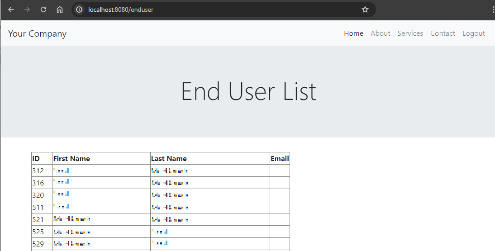

# Spring-Boot-Oracle-Connect
A Spring Boot sample application that connects to an Oracle database.
This was built with Spring Boot v.3.2.5 and Spring Security v.6.0 (Requires Java 17).

You need to update the `application.properties` file to change the following properties:
- spring.datasource.url=jdbc:oracle:thin:@//example.com:1521/SID
- spring.datasource.username=usernm
- spring.datasource.password=pass

The files `EndUserController.java` and `EndUser.java` have the Spring configuration/annotations for reading the EndUser database (Oracle) table and converting the data to instances of the EndUser class.

Sample output of reading the EndUser table:

